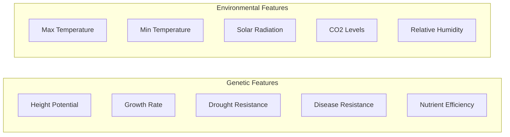
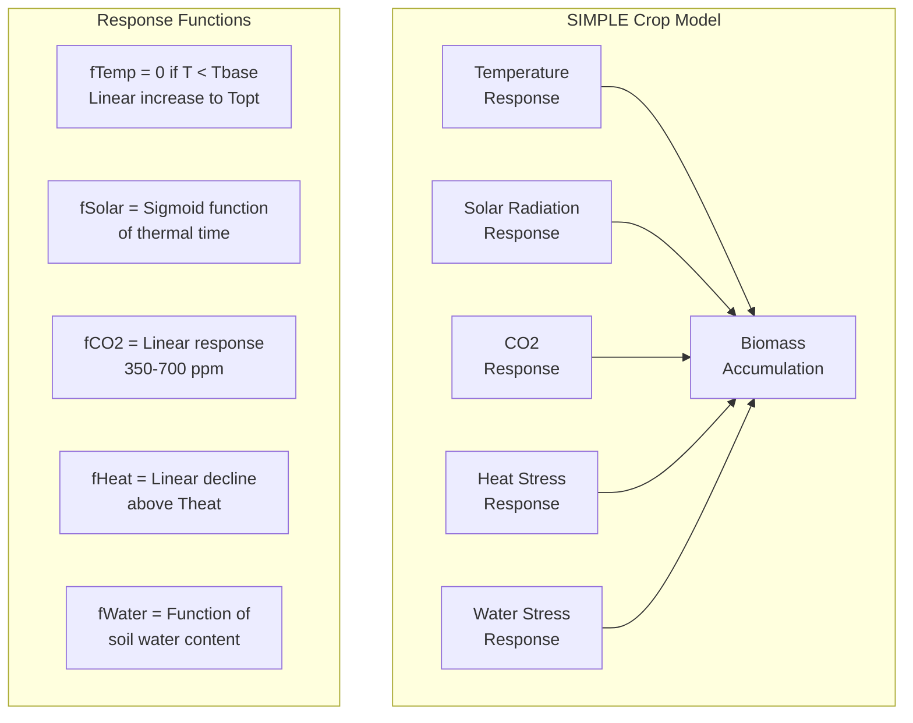
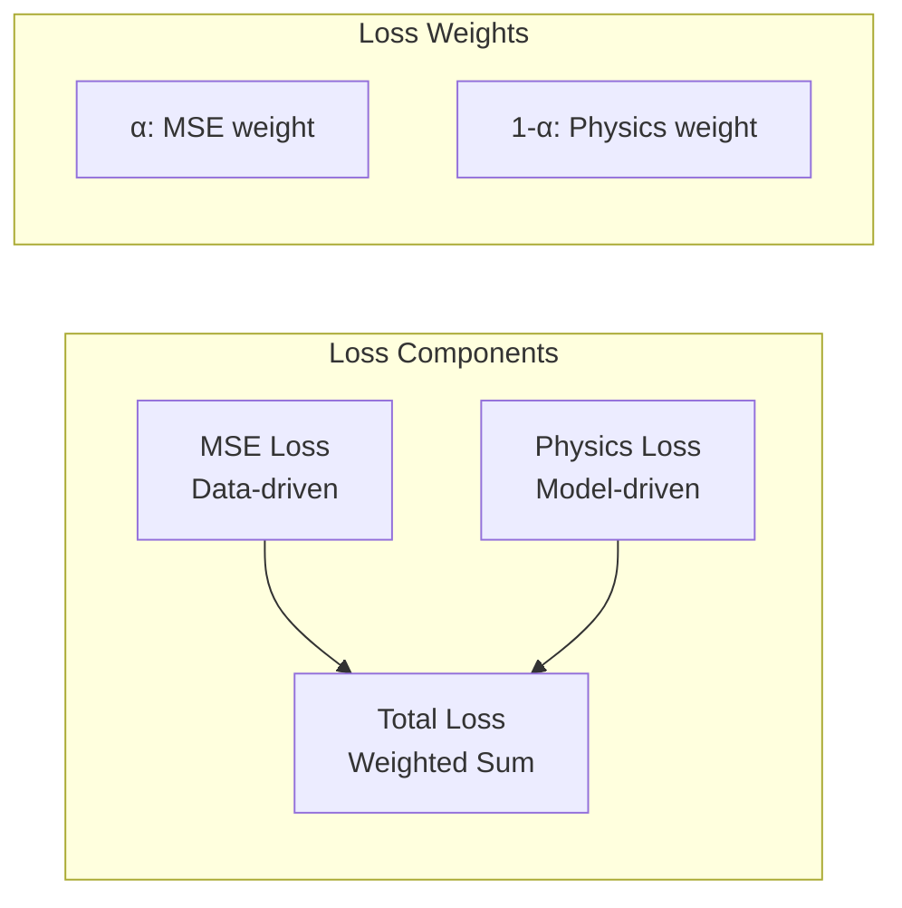
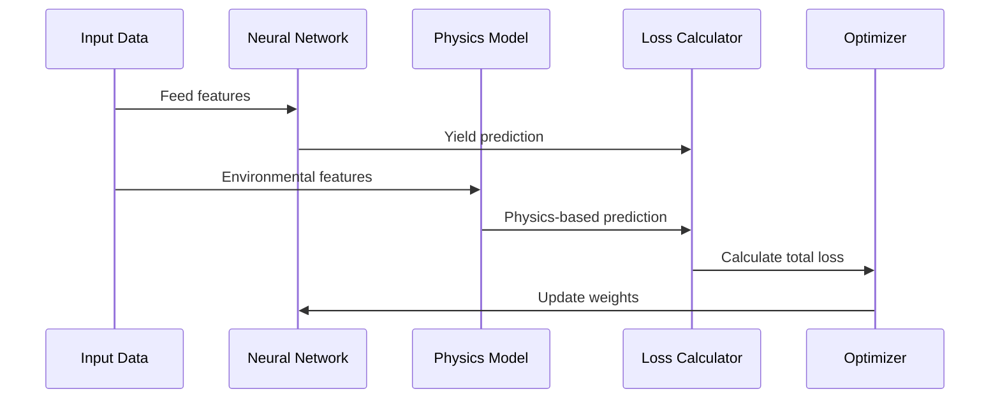

# PINN Crop Model Architecture

## Model Overview
```mermaid
graph TD
    subgraph Input
        G[Genetic Features<br/>5 dimensions] --> GE
        E[Environmental Features<br/>5 dimensions] --> EE
        E --> PCM
    end

    subgraph Neural_Network[Neural Network Component]
        GE[Genetic Encoder<br/>5→64→32] --> C
        EE[Environmental Encoder<br/>5→64→32] --> C
        C[Concatenate<br/>64 dimensions] --> D
        D[Decoder<br/>64→32→1] --> YP
        YP[Yield Prediction]
    end

    subgraph Physics_Model[SIMPLE Crop Model]
        PCM[Physics Crop Model] --> PP
        PP[Physics Prediction]
    end

    subgraph Loss_Calculation[Loss Components]
        YP --> MSE
        PP --> PL
        GT[Ground Truth] --> MSE
        YP --> PL
        MSE[MSE Loss] --> TL
        PL[Physics Loss] --> TL
        TL[Total Loss<br/>α×MSE + (1-α)×Physics]
    end

    style Neural_Network fill:#e6f3ff,stroke:#4a90e2
    style Physics_Model fill:#ffe6e6,stroke:#e24a4a
    style Loss_Calculation fill:#e6ffe6,stroke:#4ae24a
```

## Detailed Component Breakdown

### 1. Input Features


### 2. SIMPLE Crop Model Components


### 3. Loss Calculation Detail


## Training Process Flow


## Key Features
1. **Hybrid Architecture**
   - Combines data-driven (Neural Network) and physics-based (SIMPLE) approaches
   - Ensures predictions are both accurate and physically meaningful

2. **Dual Loss Function**
   - MSE Loss: Measures prediction accuracy against actual data
   - Physics Loss: Ensures compliance with crop growth principles
   - Weighted combination allows balance between data and physics

3. **Feature Processing**
   - Separate encoders for genetic and environmental features
   - Allows model to learn specific patterns in each domain
   - Combined decoder for integrated yield prediction

4. **Physics Integration**
   - SIMPLE model provides mechanistic constraints
   - Key processes: temperature response, CO2 fertilization, radiation use
   - Helps prevent physically impossible predictions
